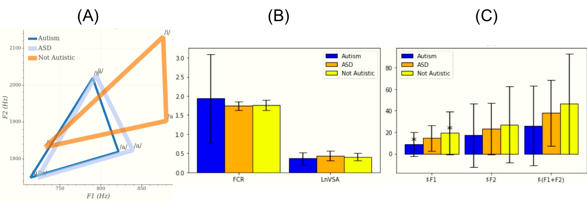
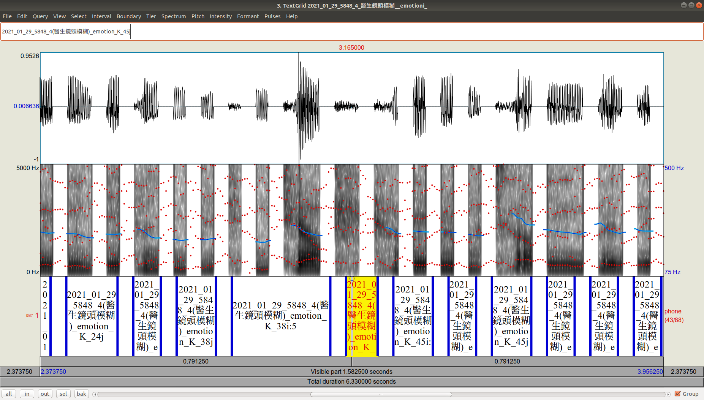
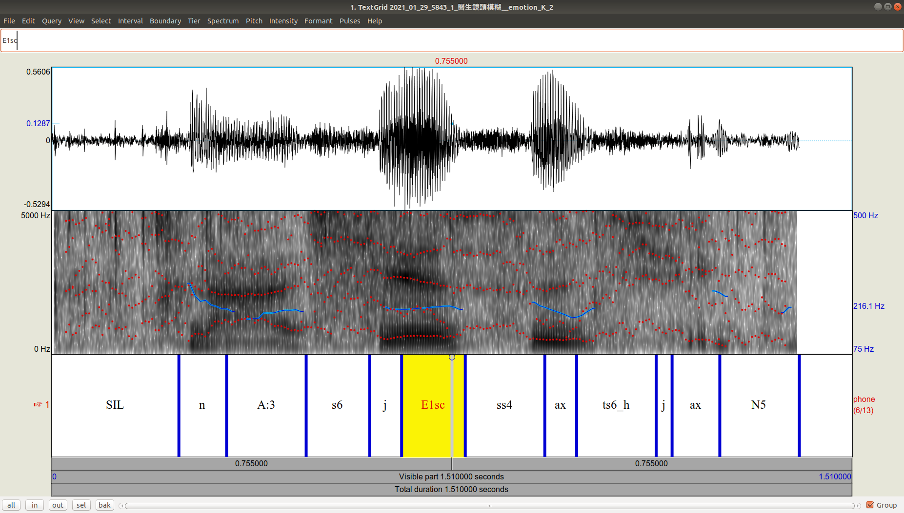

Guide:

這邊紀錄一下做Formant分析報告的步驟

* 首先： 利用畫圖的code (Analyze_F1F2.py, Analyze_F1F2_VowelFormantFeatures.py, Analyze_F1F2_tVSA_FCR.py)來畫出主要分析圖（scatter or histogram）
* 第二： 畫出特定feature的相關性圖，對角線上的點都是比較有可能有相關的點
* 第三： 截圖並手動輸入那些feature數值

test_articulation.sh: 沒啥屁用

Get_F1F2.py: 更改過articulation.py 的function 拿來算F1, F2

get_F1F2_feature.py: 將算好的F1, F2變成Session level feature的形式

Analyze_F1F2_tVSA_FCR.py: 主要拿來分析tVSA_FCR和F-value的腳本

Analyze_F1F2_VowelFormantFeatures.py: 主要拿來分析F1 F2的mean, std, skew, kurtosis的腳本

Analyze_F1F2.py: 主要拿來分析各個vowel的F1 F2的散佈情況(畫圖和做檢定)

## CalculatenPlotVSA_bydiagnosis.py:
---
這個腳本拿來畫圖支援IS2021的paper，

## CalculatenPlotSampleScatter_bydiagnosis.py

##  InspectF1F2Details.py 
---
這個腳本拿來產生praat檔，目的是用來檢查某個人的F1 F2 derive的結果怎樣。
範例圖：

流程：
1. 根據上圖看出大略critical phone （AUI） 的狀況，至於這個phone在某個utterance發生了什麼狀況就要檢查Inspect/fileOfInterest/{utterance name}了

---
